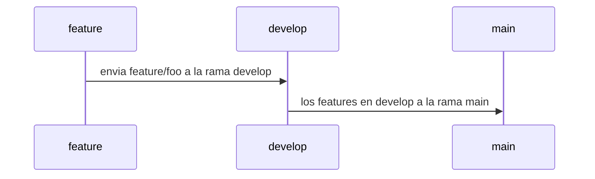

# SOCIAL OPLESK
### 🏴‍☠️ HACK-GROUP

<br/>

📚 docs [comandos git](https://gist.github.com/dasdo/9ff71c5c0efa037441b6) | [markdown 1](https://agea.github.io/tutorial.md/) | [markdown 2](https://docs.github.com/es/get-started/writing-on-github/getting-started-with-writing-and-formatting-on-github/basic-writing-and-formatting-syntax) | [archivos de salud](https://docs.github.com/es/communities/setting-up-your-project-for-healthy-contributions/creating-a-default-community-health-file)
---

```diff
- NOTA HACER LAS PRÁCTICAS MEDIANTE LA CONSOLA DE GIT BASH  
```

```
Se tienen 4 alias (alfa, bravo, charlie, delta), cada alia representa un integrante del equipo, 
si tu equipo tiene un integrante extra se llamara (echo) el procedimiento a realizar es el siguiente,
se necesita crear un circulo hábil en el manejo del pull request, para tal fin. 

Los integrantes deben definir la asignación de los alias del circuito
El circuito inicia con el usuario alfa
```
```diff
* Tienen que crear 4 repositorios y 1 repositorio extra, solo si tienen a echo en el equipo.
* El usuario a cargo del circuito según el turno del alias, aceptara las solicitudes de pull request del equipo
* Definir un contenido en el README.md con la siguiente estrucutra:
  * (titulo con el alias del encargado del repo / tabla de integrantes donde se refleje el nombre, ubicación de cada integrante) 
* Copie el fragmento de texto que esta contenido en el sector PULL_REQUEST_TEMPLATE en el archivo PULL_REQUEST_TEMPLATE.md
```
<br/>

|Hacks | Details | 
|----------|---------|
| H-1      | Pull Request alfa |
| H-2      | Pull Request bravo |
| H-3      | Pull Request charlie | 
| H-4      | Pull Request delta |
| H-5      | (Solo si "echo" esta en el equipo) Pull Request echo |
<br/> 

---

### WORKFLOW



---

### PULL_REQUEST_TEMPLATE
```sh
# Tipo de usuario
- [ ] Alfa
- [ ] Bravo 
- [ ] Charlie
- [ ] Delta
- [ ] Echo

# Seleccione el tipo de actividad
- [ ] Feature
- [ ] Hotfix
- [ ] Refactor
- [ ] Performance
- [ ] Testing
```

### Skeleton Directory

```diff
📁 docs/PULL_REQUEST_TEMPLATE.md
README.md
```
---

## 🏆 H-1 (Pull Request Alfa)

#### 👽 (Alfa)
```sh
 1. (Alfa) debe crear el repositorio "hg_1_alfa" más el archivo README.md
 
 2. (Alfa) crea la rama develop y anexar un archivo PULL_REQUEST_TEMPLATE.md dentro del repositorio /docs,
    luego hacer merge con main el archivo PULL_REQUEST_TEMPLATE.md debe contener el template de ejemplo
    docs/PULL_REQUEST_TEMPLATE.md

 3. Los usuarios deben hacer fork del repositoio cuando los pasos anteriores esten listos
 
 4. Cada usuario debe enviar 1 archivo con extensión "txt" con el nombre de su alias al repositorio:
    feature/bravo
    feature/charlie
    feautre/delta
    feature/echo (solo si existe echo en el equipo)
    
 5. (Alfa) solo aceptara cada feature de pull request, con petición de merge a la rama develop
     branch feature -> branch develop
    
 6. (Alfa) debe enviar los cambios de la rama develop a la rama(principal) main   
 
 7. Los integrantes del proyecto deben hacer una actualización de su sucursal(repositorio) local
    git remote add upstream url_del_repositorio_alfa
    git fetch upstream
    git switch main
    git merge upstream/main
```

## 🏆 H-2 (Pull Request Bravo)

#### 👽 (Bravo)
```sh
 1. (Bravo) debe crear el repositorio "hg_1_bravo" más el archivo README.md
 
 2. (Bravo) crea la rama develop y anexar un archivo PULL_REQUEST_TEMPLATE.md dentro del repositorio /docs, 
    luego hacer merge con main el archivo PULL_REQUEST_TEMPLATE.md debe contener el template de ejemplo
    docs/PULL_REQUEST_TEMPLATE.md

 3. Los usuarios deben hacer fork del repositoio cuando los pasos anteriores esten listos
 
 4. Cada usuario debe enviar 1 archivo con extensión "txt" con el nombre de su alias al repositorio:
    feature/alfa
    feature/charlie
    feautre/delta
    feature/echo (solo si existe echo en el equipo)
    
 5. (Bravo) solo aceptara cada feature de pull request, con petición de merge a la rama develop
     branch feature -> branch develop
     
 6. (Bravo) debe enviar los cambios de la rama develop a la rama(principal) main   
 
 7. Los integrantes del proyecto deben hacer una actualización de su sucursal(repositorio) local
    git remote add upstream url_del_repositorio_bravo
    git fetch upstream
    git switch main
    git merge upstream/main 
```

## 🏆 H-3 (Pull Request Charlie)

#### 👽 (Charlie)
```sh
 1. (Charlie) debe crear el repositorio "hg_1_charlie" más el archivo README.md
 
 2. (Charlie) crea la rama develop y anexar un archivo PULL_REQUEST_TEMPLATE.md dentro del repositorio /docs, 
    luego hacer merge con main el archivo PULL_REQUEST_TEMPLATE.md debe contener el template de ejemplo
    docs/PULL_REQUEST_TEMPLATE.md

 3. Los usuarios deben hacer fork del repositoio cuando los pasos anteriores esten listos
 
 4. Cada usuario debe enviar 1 archivo con extensión "txt" con el nombre de su alias al repositorio:
    feature/alfa
    feature/bravo
    feautre/delta
    feature/echo (solo si existe echo en el equipo)
    
 5. (Charlie) solo aceptara cada feature de pull request, con petición de merge a la rama develop
    branch feature -> branch develop
    
 6. (Charlie) debe enviar los cambios de la rama develop a la rama(principal) main   
 
 7. Los integrantes del proyecto deben hacer una actualización de su sucursal(repositorio) local
    git remote add upstream url_del_repositorio_charlie
    git fetch upstream
    git switch main
    git merge upstream/main 
```

## 🏆 H-4 (Pull Request Delta)

#### 👽 (Delta)
```sh
 1. (Delta) debe crear el repositorio "hg_1_delta" más el archivo README.md
 
 2. (Delta) crea la rama develop y anexar un archivo PULL_REQUEST_TEMPLATE.md dentro del repositorio /docs, 
    luego hacer merge con main el archivo PULL_REQUEST_TEMPLATE.md debe contener el template de ejemplo
    docs/PULL_REQUEST_TEMPLATE.md

 3. Los usuarios deben hacer fork del repositoio cuando los pasos anteriores esten listos
 
 4. Cada usuario debe enviar 1 archivo con extensión "txt" con el nombre de su alias al repositorio:
    feature/alfa
    feature/bravo
    feautre/charlie
    feature/echo (solo si existe echo en el equipo)
    
 5. (Delta) solo aceptara cada feature de pull request, con petición de merge a la rama develop
    branch feature -> branch develop
    
 6. (Delta) debe enviar los cambios de la rama develop a la rama(principal) main   
 
 7. Los integrantes del proyecto deben hacer una actualización de su sucursal(repositorio) local
    git remote add upstream url_del_repositorio_delta
    git fetch upstream
    git switch main
    git merge upstream/main 
```
---
<h3 align="center">SOCIAL OPLESK</h3>
